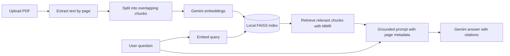

# Local PDF Knowledge Base

A portfolio-ready Retrieval-Augmented Generation (RAG) application that lets a user upload a PDF and ask natural-language questions about it. The application retrieves relevant passages with semantic search and instructs Google Gemini to answer strictly from those passages, with page citations.

## Features

- Upload and parse text-based PDF documents
- Page-aware recursive text chunking
- Gemini vector embeddings
- In-memory local FAISS vector index
- Maximal Marginal Relevance (MMR) retrieval for relevant, diverse context
- Grounded Gemini answers with page citations
- Expandable source passages for transparency
- Session-based chat history
- API key support through the UI, environment variables, or Streamlit secrets
- Prompt-injection defense: PDF content is treated as data, never as instructions

## RAG workflow



The indexing stage converts page-aware chunks into dense vectors and stores them in FAISS in the current Streamlit session. At question time, the same embedding model represents the query, FAISS retrieves semantically related chunks, and only those chunks are supplied to the chat model. The system prompt requires the model to decline when the retrieved context is insufficient.

> **Privacy note:** FAISS runs locally and the app does not persist the uploaded PDF or index. However, PDF chunks are sent to the Google Gemini API to create embeddings, and retrieved chunks are sent to Gemini when answering questions.

## Tech stack

| Component | Technology |
|---|---|
| Web UI | Streamlit |
| PDF parsing | pypdf |
| RAG orchestration | LangChain |
| Embeddings | Google Gemini `gemini-embedding-001` |
| Vector database | FAISS (local, in memory) |
| Answer generation | Google Gemini `gemini-2.5-flash` |

## Project structure

```text
local-pdf-knowledge-base/
├── app.py
├── requirements.txt
└── README.md
```

## Getting started

### 1. Prerequisites

- Python 3.10–3.12
- A Google Gemini API key from [Google AI Studio](https://aistudio.google.com/app/apikey)

### 2. Create and activate a virtual environment

```bash
python -m venv .venv
```

macOS/Linux:

```bash
source .venv/bin/activate
```

Windows PowerShell:

```powershell
.venv\Scripts\Activate.ps1
```

### 3. Install dependencies

```bash
pip install -r requirements.txt
```

### 4. Configure the API key

Choose one of these options:

**Option A — environment variable**

macOS/Linux:

```bash
export GOOGLE_API_KEY="your-api-key"
```

Windows PowerShell:

```powershell
$env:GOOGLE_API_KEY="your-api-key"
```

**Option B — Streamlit secrets**

Create `.streamlit/secrets.toml`:

```toml
GOOGLE_API_KEY = "your-api-key"
```

**Option C — app sidebar**

Paste the key into the password field at runtime. The app does not write it to disk.

### 5. Run the application

```bash
streamlit run app.py
```

Open the local URL shown by Streamlit, upload a PDF, select **Process PDF**, and ask questions.

## Configuration

The sidebar exposes three useful RAG controls:

- **Chunk size:** maximum characters per chunk. Larger chunks preserve more local context but can reduce retrieval precision.
- **Chunk overlap:** repeated characters between adjacent chunks, which helps preserve ideas crossing a boundary.
- **Retrieved chunks:** how many passages are supplied to Gemini for each question.

The model constants can also be changed near the top of `app.py`.

## Limitations

- Image-only or scanned PDFs require OCR before upload.
- Complex tables, diagrams, and multi-column layouts may not extract perfectly with `pypdf`.
- The index is intentionally session-local and disappears when the Streamlit session ends.
- Answer quality depends on PDF extraction quality and whether retrieval finds sufficient evidence.
- Gemini API usage may incur costs and is subject to the account's quotas.

## Engineering highlights

This project demonstrates document ingestion, metadata-preserving chunking, vector embeddings, local similarity search, retrieval diversification, prompt design, source attribution, session-state management, secret handling, and graceful error reporting—the core components of a production-oriented RAG prototype.

## License

Released under the MIT License. Add a `LICENSE` file before publishing if desired.
